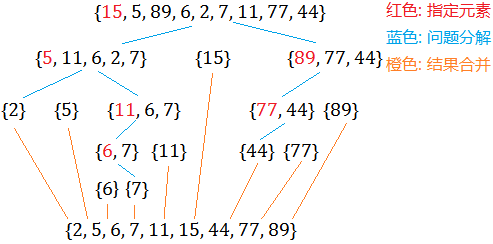

# 快速排序

## 思想

- 递归、分治思想的典型代表
- 递归: 问题可以划分成多个相同(事情相同, 规模变小简化)的子问题
- 分治: 分而治之, 将一个复杂的问题分解为多个简单问题, 将简单问题的结果合并起来得到复杂问题的结果
- 快速排序:
    - 考虑将原问题划分为两个部分, 为了方便介绍以升序排序为例, 使得这两部分满足如下条件
        - 左边部分小于指定元素
        - 右边部分大于指定元素
    - 这里提到的"指定元素", 为了编程方便, 可以考虑直接使用最左边的元素
    - 将原问题转化为上叙结果时, 其实相当于已经部分有序, 也即是简化了问题
    - 只需要再将左右两部分分别进行上叙步骤, 直到完全有序即可
    - 整个问题在不断划分不断简化, 也就体现了分治; 同时, 不同的子问题做的都是相同的事情, 因此可以调用相同的函数, 也就是递归
    - 举例:

        
    
    - 复杂度分析
        - 空间复杂度: 只需要一个辅助变量存储"指定元素", 因此空间复杂度为$O(1)$
        - 时间复杂度:
            - 最佳情况: 假设每次划分均恰好将原数组划分为两个大小相同的数组, 那么经过$log_2n$次划分之后, 数组中均只包含1个元素; 而每次划分进行处理所需遍历的次数为n, 因此时间复杂度为$nlog_2n$
            - 最坏情况: 每次划分后得到的两个数组大小分别为$1, n-1$, 则需要经过n次划分, 此时的时间复杂度为$O(n^2)$
            - 平均情况: 留做思考?
- 深入思考: 遇到复杂的问题, 可能会划分成N个问题, 不同的问题将会使用不同的函数, 也就是"复杂分治, 复杂递归", 是否可以沿用上面的思想呢? 如果能用, 是否需要满足什么样的条件呢?

## 代码

```C
// 可否增加一个参数, 让调用者自定义升序降序呢?
// 可否增加一个参数, 让调用者自定义比较关系呢? 
void quick_sort(int *array, int left, int right)
{
    if (left >= right)  //结速条件
        return;

    int i = left;
    int j = right;
    int key = array[left];

    while (i < j)
    {
        // 确保右边的都大于key
        while (i < j && key <= array[j])
            j--;
        array[i] = array[j];

        // 确保左边的都小于key
        while (i < j && key >= array[i])
            i++;
        array[j] = array[i];
    }

    array[i] = key;
    quick_sort(array, left, i - 1);
    quick_sort(array, i + 1, right);
}
```

## 附加题

### 问题描述

现有乱序一数组, 将其进行排序, 且排序规则如下:
- 奇数排在偶数的前面
- 奇数部分按从小到大排序
- 偶数部分按从大到小排序

### 解决思路

- 思路1
    - 先将奇数偶数分开, 如何分开呢?
        - 如果嵌套两层循环就太费劲了
        - 设置两个指针, 分别指向数组的开头和结尾
        - 将两个指针分别向中间移动, 如果左边的指针遇到偶数, 右边指针遇到奇数, 则交换位置
        - 直到两个指针相遇为止
    - 对奇数进行升序排序, 直接使用快排代码即可
    - 对偶数进行降序排序, 直接使用快排代码即可
- 思路2
    - 设置一个比较函数, 使其满足题目的要求
    - 在快排代码中的比较换成比较函数, 则就可以直接使用快排代码对整个数组进行排序了
- 对比分析
    - 两种思路, 时间复杂度本质上是相同的, 留做分析题目, 为何会相同?
    - 不过, 明显思路2会更加让人眼前一亮, 思路开阔

### 代码

```C
#include <iostream>

#define N 15

// 为了满足附加题的要求, 对原快排代码进行改写
void quick_sort(int *array, int left, int right, bool(*compare)(int, int, bool))
{
    if (left >= right)  //结速条件
        return;

    int i = left;
    int j = right;
    int key = array[left];

    while (i < j)
    {
        // 确保右边的都大于key
        while (i < j && compare(key, array[j], true))
            j--;
        array[i] = array[j];

        // 确保左边的都小于key
        while (i < j && compare(key, array[i], false))
            i++;
        array[j] = array[i];
    }

    array[i] = key;
    quick_sort(array, left, i - 1, compare);
    quick_sort(array, i + 1, right, compare);
}

// 升序排序
bool cmp_ascend(int v1, int v2, bool key)
{
    if (key)
        return v1 <= v2;
    else
        return v1 >= v2;
}

// 降序排序
bool cmp_descend(int v1, int v2, bool key)
{
    if (key)
        return v1 >= v2;
    else
        return v1 <= v2;
}

// 附加题规则排序
bool cmp(int v1, int v2, bool key)
{
    if (key)
        if ((v1 + v2) % 2 == 0)
            if (v1 % 2 == 0)
                return v1 >= v2;
            else
                return v1 <= v2;
        else
            if (v1 % 2 == 0)
                return false;
            else
                return true;
    else
        if ((v1 + v2) % 2 == 0)
            if (v1 % 2 == 0)
                return v1 <= v2;
            else
                return v1 >= v2;
        else
            if (v1 % 2 == 0)
                return true;
            else
                return false;
}

// 思路1
void split_odd_even(int *array, int left, int right)
{
    int i = left;
    int j = right;
    while (i < j)
    {
        while (i < j && (array[j] % 2 == 0))
            j--;
        while (i < j && (array[i] % 2 != 0))
            i++;
        int temp = array[i];
        array[i] = array[j];
        array[j] = temp;
    }

    quick_sort(array, 0, i, cmp_ascend);
    quick_sort(array, i+1, right, cmp_descend);
}

int main()
{
    int array[N];

    srand(0);
    for (int i = 0; i < N; i++)
        array[i] = rand();

    std::cout << "排序前: ";
    for (int i = 0; i < N; i++)
        std::cout << array[i] << ", ";
    std::cout << std::endl;

    // 思路1
    // split_odd_even(array, 0, N);

    // 思路2
    quick_sort(array, 0, N, cmp);

    std::cout << "排序后: ";
    for (int i = 0; i < N; i++)
        std::cout << array[i] << ", ";
    std::cout << std::endl;

    getchar();
    return 0;
}
```

