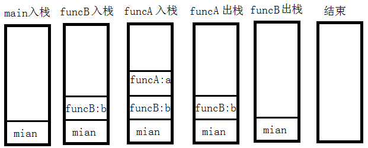

# 栈 & 队列

- 是什么?
    - 这两个词语, 其实本身就已经很通俗易懂了
    - 栈: 洗碗时, 第一次洗时, 通常会把大的碗放洗好了放下面, 挨着堆叠, 第二次清洗时, 最先清洗的碗也是第一次洗时最后洗的碗. 也就是栈的规律: **先进后出**.
    - 队列: 平时食堂去打饭, 就会排队, 这有一个规律:先排队的人, 肯定在前面, 就会先拿到饭. 也就是队列的规律: **先进先出**
- 有什么用?
    - 栈的作用
        - 一个复杂的工程通常包含各种函数调用关系, 不同的函数内部有自己的局部变量, 调用结束后会释放相应的内存空间, 以便节省内存的使用
        - 因此用于管理程序运行很方便
        - 例如:
        
            ```C++
            #include <iostream>
            void funcA() {
                int a = 1;
                std::cout << "funcA, a=" << a << std::endl;
            }
            void funcB() {
                int b = 10;
                funcA();
                std::cout << "funcB, b=" << b << std::endl;
            }
            int main()
            {
                funcB();
                return 0;
            }
            ```
            
    - 队列的作用
        - 提供了一个缓冲功能, 来不及处理, 又不能丢弃, 先放入队列存在, 空了再处理
        - 假设淘宝上, 1000个客户同时间段内买东西, 但是只有一个CPU, 处理不过来, 暂时使用订单队列存储下来
        - 为什么此时不使用栈呢? 总不能让最开始买东西的人, 一直等着吧?
        - 为什么不使用不同的顺序表/链表呢? 如果随机从缓存中取订单处理, 可能存在某个人的订单一直等了很久都没有被处理.
- 如何实现?
    - 队列
        - 双链表的方式
    
        ```C++
        #include <stdlib.h>
        
        struct node
        {
            struct node *next;
            struct node *front;
            int data;
        };
        
        class queue
        {
        public:
            queue() {};
            ~queue() {
                while (tail != NULL) {
                    tail = tail->next;
                    free(tail->front);
                }
            };
            void push(struct node t) {
                struct node* temp = (struct node*)malloc(sizeof(struct node));
                temp->data = t.data;
                temp->front = NULL;
                temp->next = NULL;
                if (tail == NULL) {
                    head = temp;
                    tail = temp;
                }
                else {
                    temp->next = tail;
                    tail->front = temp;
                    tail = temp;
                }
            };
            struct node pop() {
                struct node temp;
                temp.data = head->data;
                temp.front = NULL;
                temp.next = NULL;
                head = head->front;
                free(head->next);
                return temp;
            };
        private:
            struct node* head = NULL;  // 指向链表头
            struct node* tail = NULL;  // 指向链表尾
        };
        ```
      
        - 单链表方式如何实现?
    
    - 栈
        - 单链表实现

        ```C++
        #include <stdlib.h>
        
        struct node
        {
            struct node *next;
            int data;
        };
        
        class stack
        {
        public:
            stack() {};
            ~stack() {
                while (head != NULL) {
                    struct node* temp = head;
                    head = head->next;
                    free(temp);
                }
            };
            void push(struct node t) {
                struct node* temp = (struct node*)malloc(sizeof(struct node));
                temp->data = t.data;
                temp->next = NULL;
                if (head == NULL) {
                    head = temp;
                }
                else {
                    temp->next = head;
                    head = temp;
                }
            };
            struct node pop() {
                struct node temp;
                temp.data = head->data;
                temp.next = NULL;
                struct node *temp_;
                temp_ = head;
                head = head->next;
                free(temp_);
                return temp;
            };
        private:
            struct node* head = NULL;  // 指向链表头
        };
        ```
