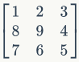
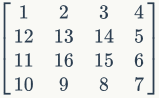
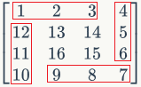

# 蛇形矩阵查找问题

## 问题描述

对于大小为N的矩阵A, 其满足这样的规律:

- 其最小数为1, 最大数为```N*N```
- 且由外而内, 顺时针递增
- 例如当```N=3, 4```时, 其矩阵分别为:

$$
\begin{bmatrix}
1 & 2 & 3\\ 
8 & 9 & 4\\ 
7 & 6 & 5
\end{bmatrix}
$$

$$
\begin{bmatrix}
1 & 2 & 3 & 4\\ 
12 & 13 & 14 & 5\\ 
11 & 16 & 15 & 6\\
10 & 9 & 8 & 7
\end{bmatrix}
$$





现, 要求输入任意整数N, M. 要求计算出M在大小为N的矩阵中的行列坐标:

- 注: 如果不在矩阵中, 返回的行列均为-1
- 例: 当```N=3, M=8时```, 返回 row = 2, col = 1

## 解决思路

- 根据题意, 如果将矩阵看成是很多个圈的话, 每个圈都是顺时针递增的
- 所以先确定在哪个圈, 再确定具体位置
- 每个圈的数值数量是很有规律的, 例如从外到内将每个圈分别编号为: 1,2,3,...
- 那么第i圈的数值个数为: $4(N-2(i-1)-1)$
    - 规律可以这样总结出来

        
        
    - 所以第i圈时, 每边的长度为: $N - 2(i-1) - 1$
    - 以行来看, 每往内走一圈时, 首尾均减少1列, 所以上面的公式中会有: $-2*(i-1)$
- 当确定到圈后, 就该确定到具体的位置了
- 其实确定到圈时, 对应圈的最小最大数均可以得到
- 为了得到M相对于对应圈的最小值的位置, 只需要减掉最小值即可.
    - 从这里可以发现, 有些时候看成是从0开始是有很多好处的
    - 回想到数学里面, 也是一样的道理. 例如缩放操作, 其本质的东西不会变化, 且能够简化问题, 容易理解
- 根据相对位置, 可以算出具体的位置, 具体见代码部分

## 代码

```C
void find_row_col(int n, int m, int &row, int &col)
{
	// 边界条件
	if (n <= 0 || (m <= 0 || m > n*n))
	{
		row = -1;
		col = -1;
		return;
	}
	int layer_start = 0;  //对应层的开始数值
	int layer_end = 0;  //对应层的结速数值
	for (int i = 1; i <= n / 2; i++) {
		layer_start = layer_end+1;
		layer_end += 4 * (n - (i-1)*2 - 1);
		if (m <= layer_end) {
			//确定边
			int side = (m - layer_start) / (n - (i - 1) * 2 - 1);
			//确定所在边的具体位置, 取余之后为什么要 +1 呢? 思考一下
			int seat = (m - layer_start) % (n - (i - 1) * 2 - 1) + 1;
			if (side == 0) {
				row = i;  // 第i行
				col = seat + i - 1;
			}
			else if (side == 2) {
				row = n - i + 1;  //倒数第i列
				col = n - (seat + i - 1) + 1;
			}
			else if (side == 1) {
				row = seat + i - 1;
				col = n - i + 1;  // 倒数第i行
			}
			else if (side == 3) {
				row = n - (seat + i - 1) + 1;
				col = i;  //第i列
			}
			return;
		}
	}
	if (m > layer_end) {  //当n为奇数的情况
		row = n / 2 + 1;
		col = n / 2 + 1;
	}
}
```
