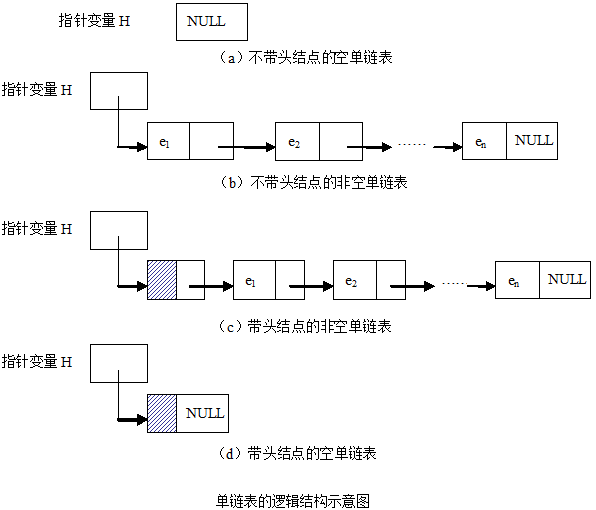
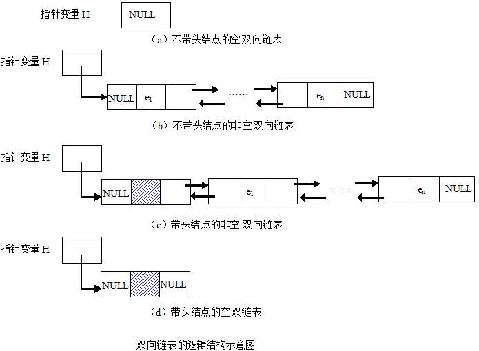

# 链表

## 什么是链表? 为什么需要链表?

- 数组, 在内存中是一种顺序结构, 也就是内存物理意义上是连续空间
- 通常计算机都会同时跑很多个程序, 不同的程序占用内存不同区域的空间, 产生的后果显然, 内存可用的空间变得散乱
- 此时如果想创建一个比较大的数组, 但没有那么大的连续内存空间, 则会创建失败
- 事实上, 散乱的空间合起来还是很大的可用资源
- 链表也就是在这种情况下产生作用的
- 那么, 链表具体是什么呢? 为什么能够达到上述的功效?
- 要达到上述功效, 除了存储数据本身外, 还需要存储额外的信息——数据地址
- 什么意思呢?
    - 在使用数组的时候, 每个存储单元只需要存储数据本身即可, 因为其余每个数据, 都是相对数组头地址的偏移量而已.
    - 例如: 数组```int a[10000]```中, 获取下标为5的数据为```a[5]; or *(a+5);```, 都表示相对数组头偏移量为5时的数据.
    - 如果数据是散乱存放的, 依靠偏移量的方式就已经行不通了.
    - 正因为数据是散乱的, 且还需要随时能够找到数据, 则还需要记录每个数据的存放地址.
    - 注意: 不能直接使用数组```int *a[10000];```来存储10个数据的地址, 原因是已经没有那么多连续空间来存储10个整数了, 又怎么会有10个连续空间来存储地址呢.
    - 考虑将数据和地址打包成一个单元, 每个单元则可以散乱存储在内存的不同地方:
    
        ```
        typedef struct unit {
          int data;  // 数据本身
          struct unit* address;  // 别的某个数据地址
        }node;
        ```
- 前面的描述中, 尽管范例使用的是整型, 但一直使用的词语是数据, 因为其还可以是浮点数/结构体等
- 通过上面的描述, 其优缺点也很明显
    - 尽量使用内存的细小碎片空间
    - 同时带来了更大的空间消耗
        - 可能是原本的1.1倍, 例如数据是结构体, 且结构体中包含了10个整数
        - 也可能是原本的2倍, 例如数据是整数(int)
        - 甚至是原本的5倍, 例如数据是字符(char)
        - 注意: 通常32位计算机中, int占用4字节, char占用1字节, 数据地址占用4字节

## 单链表

- 每个单元里面包含一个数据指针, 且指向下一个数据



- 其中的```e```是数据
- 增、删、改、查

```C
typedef struct node {
  int data;
  struct node* next;
}listNode;

listNode *p;

bool find(listNode *p, int index, int* output)
{
  // 查找单链表p中第index个单元中的数据, 并将查找到的结果放入output中
  // 查找成功返回true, 否则返回false
  if (index < 0)
    return false;
  int i = 0;
  listNode *cursor;  // 移动游标, 指向当前所在结点的指针
  cursor = p->next;  // 假定单链表p带头结点
  while( i != index)
  {
    if (cursor->next == NULL)
      return false;
    cursor = cursor->next;
    i++;
  }
  *output = cursor->data;
  return true;
}

bool modify(listNode *p, int index, int input)
{
  // 修改单链表p中第index个单元中的数据为input
  // 修改成功返回true, 否则返回false
  if (index < 0)
    return false;
  int i = 0;
  listNode *cursor;  // 移动游标, 指向当前所在结点的指针
  cursor = p->next;  // 假定单链表p带头结点
  while( i != index)
  {
    if (cursor->next == NULL)
      return false;
    cursor = cursor->next;
    i++;
  }
  cursor->data = input;
  return true;
}

bool del(listNode *p, int index)
{
  // 删除单链表p中第index个单元
  // 删除成功返回true, 否则返回false
  if (index < 0)
    return false;
  int i = 0;
  listNode *cursor;  // 移动游标, 指向当前所在结点的指针
  cursor = p->next;  // 假定单链表p带头结点
  while( i != index-1)
  {
    if (cursor->next == NULL)
      return false;
    cursor = cursor->next;
    i++;
  }
  if (cursor->next == NULL)
    return false;
  listNode *temp = cursor->next;  // temp指向第index个单元
  cursor->next = temp->next;  // 第index-1个单元的指针指向第index+1个单元
  free(temp);  // 释放temp所指单元所占空间
  return true;
}

bool insert(listNode *p, int index, int input)
{
  // 在单链表p中第index个单元后增加一个单元, 并将其数据赋值为input
  // 增加成功返回true, 否则返回false
  if (index < 0)
    return false;
  int i = 0;
  listNode *cursor;  // 移动游标, 指向当前所在结点的指针
  cursor = p->next;  // 假定单链表p带头结点
  while( i != index)
  {
    if (cursor->next == NULL)
      return false;
    cursor = cursor->next;
    i++;
  }
  listNode *temp;
  temp = (listNode *)malloc(sizeof(listNode));  // 创建单元temp
  temp->data = input;
  temp->next = cursor->next;  // 将temp中的指针指向第index+1单元
  cursor->next = temp;  // 将第index单元的指针改为指向temp
  return true;
}
```

## 双向链表

- 每个单元里面包含二个数据指针, 分别指向下一个数据和上一个数据



- 增、删、改、查, 参考单链表自行实现
- 除了类似单链表的查找外, 希望能够变通
    - 查找第一个数据为e的单元的index
    - 查找第一个元素为e的前继结点
    - 查找第一个元素为e的后继结点
- 双向链表交换任意两结点(自行画图理解)

```C
void swap(listNode *left,listNode *right)
{
	listNode *temp;
	if (right->next == NULL) //right结点是否为尾结点
	{
		if (left->next == right) //left,right结点是否相邻
		{
			//与尾结点相邻的交换代码
			right->next = left;
			right->front = left->front;
			left->next = NULL;
			left->front->next = right;
			left->front = right;
		}
		else
		{
			//与尾结点不相邻的交换代码
			right->next = left->next;
			right->front->next = left;
			temp = right->front;
			right->front = left->front;
			left->next->front = right;
			left->next = NULL;
			left->front->next = right;
			left->front = temp;
		}
	}
	else
	{
		if (left->next == right) //left,right结点是否相邻
		{
			//相邻的交换代码
			right->next->front = left;
			temp = right->next;
			right->next = left;
			right->front = left->front;
			left->next = temp;
			left->front->next = right;
			left->front = right;
		}
		else
		{
			//不相邻的交换代码
			right->next->front = left;
			temp = right->next;
			right->next = left->next;
			left->next->front = right;
			left->next = temp;
			right->front->next = left;
			temp = right->front;
			right->front = left->front;
			left->front->next = right;
			left->front = temp;
		}
	}
}
```
